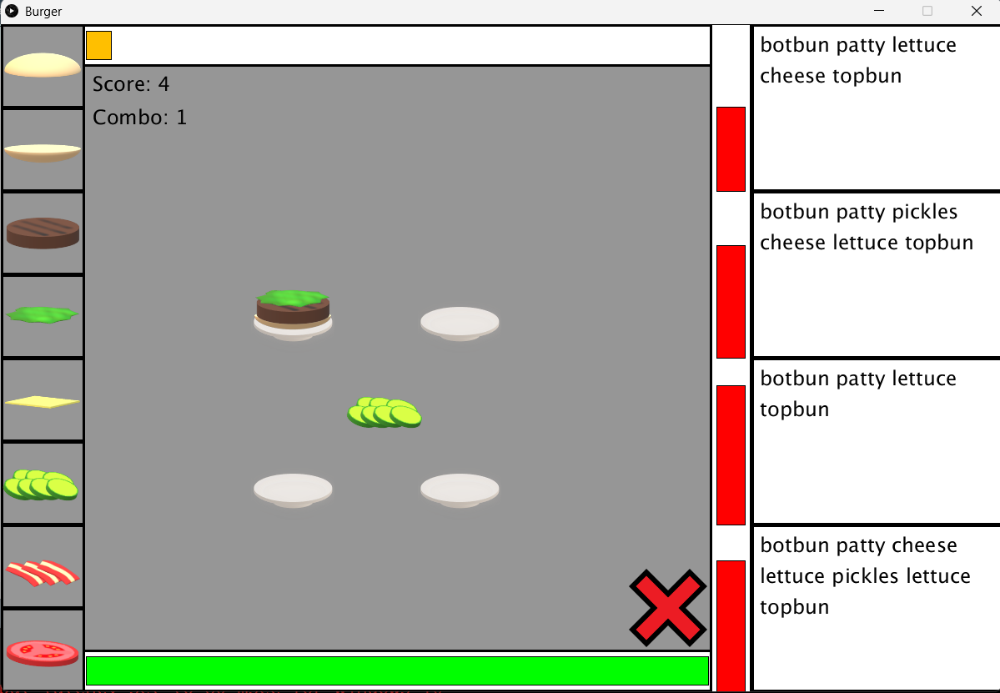

# Burger

**Burger** is a simple game I made for my brother where the player has to complete randomized burger orders before time runs out.

## Languages / Tools Used
- Processing
- Paint3D (art)
- Cakewalk (music & SFX, now called Sonar)
- Vital (music & SFX)

## How to Run
1. Open the project in Processing
2. Run `Burger.ps`

## When It Was Made
Dec 2023 - Jan 2024